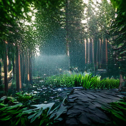
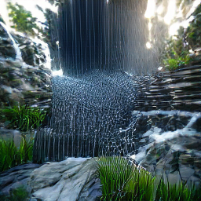
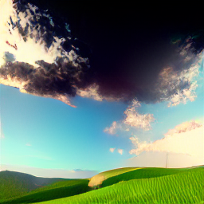
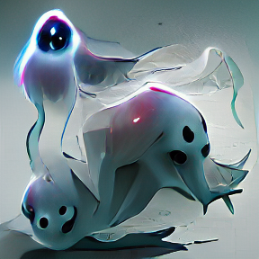
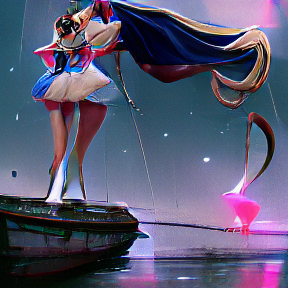
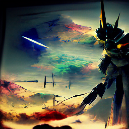

# VQGAN-CLIP-Docker

- [Setup](#Setup)
- [Usage](#Usage)
    - [Inference](#Inference)
    - [Training](#Training)
- [Acknowledgments](#Acknowledgments)
- [Citations](#Citations)

## About

> Zero-Shot Text-to-Image Generation VQGAN+CLIP Dockerized

This is a stripped and minimal dependencies repository for running locally or in production VQGAN+CLIP.

For a Google Colab notebook [see the original repository](#Acknowledgments).

## Samples

<div>
    
    
    
    
    
    
</div>


# Setup

Clone this repository and `cd` inside.

```sh
git clone https://github.com/kcosta42/VQGAN-CLIP-Docker.git
cd VQGAN-CLIP-Docker
```

You can download a pretrained VQGAN model and put it in the `./models` folder.

<table>
    <thead>
        <tr>
            <th>Dataset</th>
            <th>Link</th>
            <th>Config</th>
        </tr>
    </thead>
    <tbody>
        <tr>
            <td>ImageNet (f=16), 16384</td>
            <td><a href="http://mirror.io.community/blob/vqgan/vqgan_imagenet_f16_16384.ckpt">vqgan_imagenet_f16_16384.ckpt</a></td>
            <td>./configs/models/vqgan_imagenet_f16_16384.json</td>
        </tr>
        <tr>
            <td>ImageNet (f=16), 1024</td>
            <td><a href="http://mirror.io.community/blob/vqgan/vqgan_imagenet_f16_1024.ckpt">vqgan_imagenet_f16_1024.ckpt</a></td>
            <td>./configs/models/vqgan_imagenet_f16_1024.json</td>
        </tr>
        <tr>
            <td>FacesHQ (f=16)</td>
            <td><a href="https://app.koofr.net/links/a04deec9-0c59-4673-8b37-3d696fe63a5d?path=%2F2020-11-13T21-41-45_faceshq_transformer%2Fcheckpoints">vqgan_faceshq_f16_1024.ckpt</a></td>
            <td>./configs/models/vqgan_faceshq_f16_1024.json</td>
        </tr>
        <tr>
            <td>COCO-Stuff (f=16)</td>
            <td><a href="https://dl.nmkd.de/ai/clip/coco/coco.ckpt">vqgan_coco_f16_8192.ckpt</a></td>
            <td>./configs/models/vqgan_coco_f16_8192.json</td>
        </tr>
    </tbody>
</table>


For GPU capability, make sure you have CUDA installed on your system (tested with CUDA 11.1+).

- 6 GB of VRAM is required to generate 256x256 images.
- 11 GB of VRAM is required to generate 512x512 images.
- 24 GB of VRAM is required to generate 1024x1024 images. (Untested)

## Local

Install the Python requirements

```sh
python3 -m pip install -r requirements.txt
```

To know if you can run this on your GPU, the following command must return `True`.
```sh
python3 -c "import torch; print(torch.cuda.is_available());"
```

## Docker

> Make sure you have `docker` and `docker-compose` installed. `nvidia-docker` is needed if you want to run this on your GPU through Docker.

A Makefile is provided for ease of use.

```sh
make build  # Build the docker image
```

# Usage

## Inference

Two configuration files are provided `./configs/local.json` and `./configs/docker.json`. They are ready to go, but you may want to edit them to meet your need. Check the [Configuration section](#Configuration) to understand each field.

By default, the resulting generations can be found in the `./outputs` folder.

### GPU

To run locally:

```py
python3 -m scripts.generate -c ./configs/local.json
```

To run on docker:

```py
make generate
```

### CPU

To run locally:

```py
DEVICE=cpu python3 -m scripts.generate -c ./configs/local.json
```

To run on docker:

```py
make generate-cpu
```

### Configuration

| Argument               | Type           | Descriptions                                                                   |
|------------------------|----------------|--------------------------------------------------------------------------------|
| `prompts`              | List[str]      | Text prompts                                                                   |
| `image_prompts`        | List[FilePath] | Image prompts / target image path                                              |
| `max_iterations`       | int            | Number of iterations                                                           |
| `save_freq`            | int            | Save image iterations                                                          |
| `size`                 | [int, int]     | Image size (width height)                                                      |
| `init_image`           | FilePath       | Initial image                                                                  |
| `init_noise`           | str            | Initial noise image ["gradient","pixels","fractal"]                            |
| `init_weight`          | float          | Initial weight                                                                 |
| `mse_decay_rate`       | int            | Slowly decrease the MSE Loss each specified iterations until it reach about 0  |
| `output_dir`           | FilePath       | Path to output directory                                                       |
| `models_dir`           | FilePath       | Path to models cache directory                                                 |
| `clip_model`           | FilePath       | CLIP model path or name                                                        |
| `vqgan_checkpoint`     | FilePath       | VQGAN checkpoint path                                                          |
| `vqgan_config`         | FilePath       | VQGAN config path                                                              |
| `noise_prompt_seeds`   | List[int]      | Noise prompt seeds                                                             |
| `noise_prompt_weights` | List[float]    | Noise prompt weights                                                           |
| `step_size`            | float          | Learning rate                                                                  |
| `cutn`                 | int            | Number of cuts                                                                 |
| `cut_pow`              | float          | Cut power                                                                      |
| `seed`                 | int            | Seed (-1 for random seed)                                                      |
| `optimizer`            | str            | Optimiser ["Adam","AdamW","Adagrad","Adamax","DiffGrad","AdamP","RAdam"]       |
| `nwarm_restarts`       | int            | Number of time the learning rate is reseted (-1 to disable LR decay)           |
| `augments`             | List[str]      | Enabled augments ["Ji","Sh","Gn","Pe","Ro","Af","Et","Ts","Cr","Er","Re","Hf"] |

## Training

> These are instructions to train a new VQGAN model. You can also finetunes the pretrained models but you may need to tweak the training script.

Two models configuration files are provided `./configs/models/vqgan_custom.json` and `./configs/models/vqgan_custom_docker.json`. They are ready to go, but you may want to edit them to meet your need. Check the [Model Configuration](#Model-Configuration) to understand each field.

By default, the models are saved in the `./models/checkpoints` folder.

### Dataset

Put your image in a folder inside the data directory (`./data` by default).

The dataset must be structured as follow:

```sh
./data/
├── class_x/
│   ├── xxx.png
│   ├── xxy.jpg
│   └── ...
│       └── xxz.ppm
└── class_y/
    ├── 123.bmp
    ├── nsdf3.tif
    └── ...
    └── asd932_.webp
```

### GPU

To run locally:

```py
python3 -m scripts.train -c ./configs/models/vqgan_custom.json
```

To run on docker:

```py
make train
```

### CPU

To run locally:

```py
DEVICE=cpu python3 -m scripts.train -c ./configs/models/vqgan_custom.json
```

To run on docker:

```py
make train-cpu
```

### Model Configuration

| Argument               | Type           | Descriptions                                                              |
|------------------------|----------------|---------------------------------------------------------------------------|
| `base_learning_rate`   | float          | Initial Learning rate                                                     |
| `batch_size`           | int            | Batch size (Adjust based on your GPU capability)                          |
| `epochs`               | int            | Maximum number of epoch                                                   |
| `output_dir`           | FilePath       | Path to directory where to save training images                           |
| `models_dir`           | FilePath       | Path to directory where to save the model                                 |
| `data_dir`             | FilePath       | Path to data directory                                                    |
| `seed`                 | int            | Seed (-1 for random seed)                                                 |
| `resume_checkpoint`    | FilePath       | Path to pretrained model                                                  |

### Infos

- Let the Generator train without the Discriminator for a few epochs (~3-5 epochs for ImageNet), then enable the Discriminator. <br/> The variable `lossconfig.params.disc_start` correspond to the number of global step (ie. batch iterations) before enabling the Discriminator.
- Once enabled, the Discriminator loss will stagnate around ~1.0, __this is a normal behaviour__. The loss will decrease in later epochs. (It can take a _very_ long time).
- If you've enabled the Discriminator too soon, the Generator will take a lot more time to train.
- Basically there is no rules for the number of epochs. If your dataset is large enough, there is no risk of overfitting. So the more you train, the better.


# Acknowledgments

[VQGAN+CLIP](https://github.com/nerdyrodent/VQGAN-CLIP)

[Taming Transformers](https://github.com/CompVis/taming-transformers)

[CLIP](https://github.com/openai/CLIP)

[DALLE-PyTorch](https://github.com/lucidrains/DALLE-pytorch)

# Citations

```bibtex
@misc{unpublished2021clip,
    title  = {CLIP: Connecting Text and Images},
    author = {Alec Radford, Ilya Sutskever, Jong Wook Kim, Gretchen Krueger, Sandhini Agarwal},
    year   = {2021}
}
```

```bibtex
@misc{esser2020taming,
      title={Taming Transformers for High-Resolution Image Synthesis},
      author={Patrick Esser and Robin Rombach and Björn Ommer},
      year={2020},
      eprint={2012.09841},
      archivePrefix={arXiv},
      primaryClass={cs.CV}
}
```

```bibtex
@misc{ramesh2021zeroshot,
    title   = {Zero-Shot Text-to-Image Generation},
    author  = {Aditya Ramesh and Mikhail Pavlov and Gabriel Goh and Scott Gray and Chelsea Voss and Alec Radford and Mark Chen and Ilya Sutskever},
    year    = {2021},
    eprint  = {2102.12092},
    archivePrefix = {arXiv},
    primaryClass = {cs.CV}
}
```
